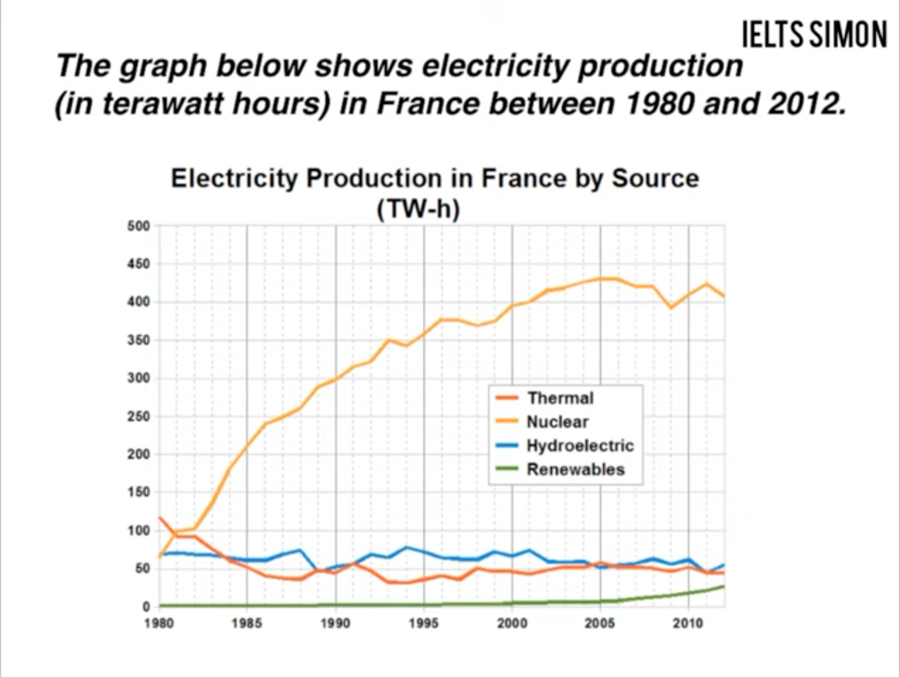
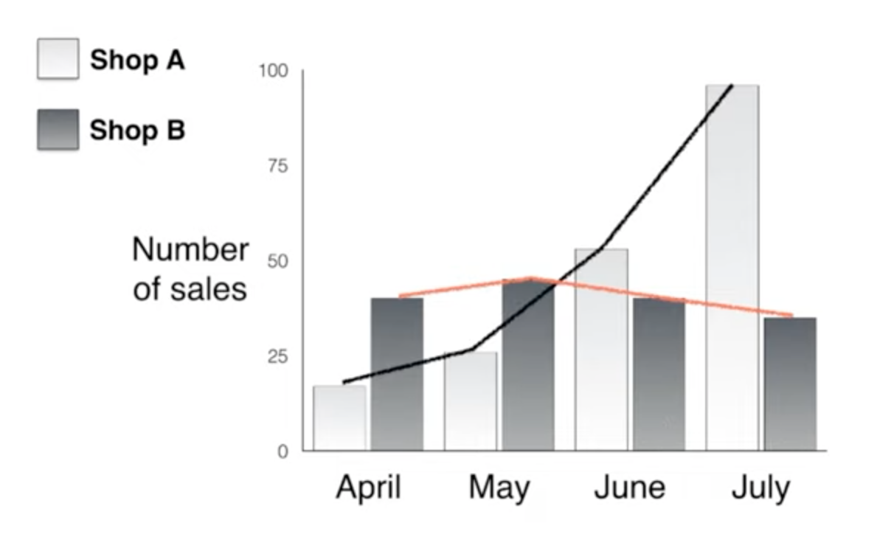
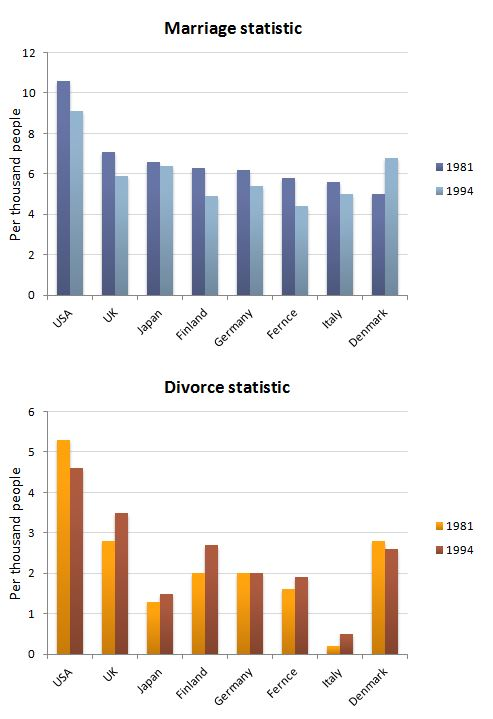

+++
author = "小林"
title = "IELTS 记录"
description = "IELTS 准备记录"
date = "2023-10-22"
type = "post"
draft = false
translationKey = "history"
coffee = 1
tags = ["IELTS","考试","留学","案牍"]
categories = ["记录"]
stage = "完稿"
history = [
  {date = "2023-10-22", stage="完稿", author = "小林", reviewer = "", note = ""},
]
toot = ""
+++

Referring to: [Ielts Simon](https://www.youtube.com/@IeltsSimon9) on Youtube, [ielts9](https://www.ielts9.me/) to help assess my writings, [readingielts](https://www.readingielts.com/ielts-speaking-part-1-from-september-to-december-2023/) for speaking topics, [examword](https://www.examword.com/), [smalltalk](https://app.smalltalk2.me/) and [ieltsonlinetests](https://ieltsonlinetests.com/zh-hans/speaking-recent-actual-tests/18904194.html) for make mock tests.

上面资料基本都是免费，smalltalk 可以练习的次数有限。另外也可以多在墙外用英文搜索一些雅思资料，比国内的多而且很多是免费。注意 ielts9 的建议非常细，但是最好不要微调后再去评分，会消耗次数而且多半分数没啥变化。可以添加一些 chrome 检查语法、写作的扩展后一起使用。
需要剑雅真题建议直接去 zlib 搜电子版，没必要花那个钱去网购。我当时在 zlib 上下了 13-17，最后就做完了 15 一本...16 做了一个还两个 test。
其实觉得这些东西并不是很能速成。写作与口语中非常重要的是你能够灵活调用的词汇量有多大，它们能不能为你提供足够的支撑，而这些东西是很难依靠他人写的速成来操作的，因为你的思路和他人思路很难重合——尤其是考验临场的口语。
体感比较见效的是对写作思路的补充，清楚的结构和一套清晰简单（可能有点傻）的逻辑能让你的作文看起来逻辑很多，省下临场根据材料组织一套自己的逻辑的过程。虽然我本人没有体验到分数上涨但是确实感觉 simon 的思路让我脱离了没头苍蝇的状态。

## 本人考试历史情况

第一次雅思笔试的时候忘记摘手表了，遂无效。
第二次雅思听读写说分别是 8/9/6.5/6，总分 7.5.非常符合直觉，因为之前都是自己刷剑雅真题，听读比较好训练写说就比较麻烦了。
第三次是 7.5/9/6.5/7，总分 7.5.这场的分数我非常不理解......不过听力是因为中间有一个我走神了最后根据大意蒙了三四个空；口语考的时候以为要完蛋了，因为考官笑容逐渐消失而且在 part1 就开始问我 why；写作本来以为花了四十块改作文可以好一点但是也没有...明明自己体感思路结构清楚了很多啊？

## Writing

academic, formal, divesity avoid casual words, contractions and vague pronouns
the use of passive voice
specific
paraphrase
avoid ambiguity, repetition(especially of informal words)
direct follow the requirements instead of offering too much of correlated analysis 

### Task 1

illustrate, depict, demonstrate, compare
facility, rate, despite
unit

descirbe
offer summaries instead of conclusions

conversational, small talk
different question type
1. with numbers
2. comparing diagrams
3. process diagrams

==4 paragraph structure==

- intro (1)
- paraphrase the question in one sentence
- overview (2)
- two main, general things
- details (2 paras for groups)
- mention all lines/ in comparison

以下是折线图、柱状图、流程图的笔记。个人认为学习过程中只要一开始花点力气搞懂思路并不需要每个类型都细看，除了流程图确实和其他图表有些差异。如果有我的笔记中没有提到的还是看 simon 的视频吧！

#### line graph

2-5 lines' changes over a period of time
compare them, do not describe them separately

overview: a very general comparison
details: compare at specific points, every line should be covered

> E.g.w1.1
> 
> ~~The electricity production~~ **The amount of the electricity produced** in France of **4** different sources, in the period of ~~year 1980 to 2012~~ **32 years**, is dipicted in the graph.
> Generally, the electricity production by nuclear energy, ~~has been higher than electricity production of all the other three kinds.~~ **was the most important means of electricity generation over the period shown.** At the same time, electricity produced by renewables stayed the lowest ~~over the whole period.~~ **in each year. 高低对比**
> 
>  
> 
> Thermal power provided ~~more than 100~~ **about 120** terawatt hours of power, constituting the main source of electricity in 1980. **In the same year, nuclear and hydroelectric energy produced just under 75 terawatt hours of electricity each, and renewables provided a negeligible amount.** ~~In 1981, the power generated by means of nuclear energy increased rapidly while the power generated by thermal energy decreased. As a result, nuclear energy became the main source of electricity generation after 1981, generating 100 terawatt hours a year.~~ **Just one year later, nuclear power overtook thermal power as the primary source of electricity.**
> The amount of electricity produced with nuclear energy ~~kept increasing~~ **rose dramatically between 1980 and 2005** ~~, and reached~~ an peak of about 425 terawatt hours ~~in 2005~~. *Meanwhile, in 2005, thermal stations and hydroelectric stations provided electricity of only 50 terawatt hours. Renewables didn't provide much electricity until 2005. The amount of electricity it was used to produce increased after 2005, and in 2012 it provided nearly 25 terawatt hours of electricity.* **这样写 renewables 没有对照组。Simon 的写法是写 the figure for thermal 降低和 nuclear 对比，hydro 稳定与 renewables 只在最后动一下对比。**

#### bar chart

some bar charts are just varied from line charts.

a typical bar-chart bar chart may have no changes over time, but comparison of different items with different attributes.

> E.g.w1.2
> The chart below compares the sales of the ~~top~~ 5 **most popular** **brands/manufacturers** for mobile phones around the globe, **during the period of 2009 to 2013 /in  the years 2009, 2011, and 2013**.
> It's noticeable that over 400 millions of Nokia products were sold in 2009 and 2011, higher than all the other brands. In the year of 2013, Samsung overtook the best-selling brand, sold almost 450 millions. As for Apple, LG, and ZTE, their products were sold less than 200 millions over the years of 2009 to 2013. **这里也可以写三星和苹果 saw the biggest rises.**
> 
> 
>
> **可以分组描述，不用一段里全说完。比如依次比较三星和诺基亚的销量，可以灵活地写出它们之间的数量关系。**
> As mentioned, Samsung's sales reached a peak of **almost /close to** 450 millions in the year of 2013. Apple and ZTE reached their peak in the same year, at about 150 millions and 50 millions **respectively**. Nokia and LG did their best in 2009, the former touching 450 millions and the latter over 100 millions. 
> Sansung's lowest sales was over 200 million, so was Nokia's lowest sales, almost half of their best records. In comparison, the lowest sales of LG and ZTE were both at something near 50 millions. Apple was an exception. Compared to **its four competitors /the other vendors** depicted in this chart, it started at almost zero.
> 
> ==Good sentences==
> **Over the following four years, however, Nokia's sales fell by approximately 200 million units, whereas Samsung saw sales rise by a similar amount.**
> **purchases of Apple handsets**

##### practice

- e.1

The bar charts below show the Marriage and Divorce Statistics for eight countries in 1981 and 1994.

Write a short report for a university lecturer describing the information shown below.

Write at least 150 words.

The statistics of marriage and divorce in 8 different countries in the year of 1981 and 1994 are compared in the below charts. 

In both years, there were more marriages and divorces conducted per thousand people in America than all the other 7 countries. ~~The number of marriages~~**marriage rates** in the other 8 countries vary in a small range from 4 to 7 per thousand people. In contrast, the figures for divorces ~~differ~~**fluctuate** a lot.

The marriages per thousand people in Denmark saw an ~~increase~~**upsurge** of about 2 from 1981 to 1994. However, all the other 7 countries experience a ~~decrease~~**decline of** no more than 1 every thousand people in marriage statistics. In 1981, every thousand American people entered more than 10 marriages, undoubtedly making America the first of all the countries compared. Even after Denmark's rapid growth **and its own decrease**, in 1994, America was still the country where most marriages were conducted **out of a thousand /per thousand people**.

Except for America, Denmark and Germany, all the other countries saw rises in the figure for divorces. In America and Denmark, divorce statistics dropped slightly. The Germans conducted 2 divorces per thousand people in 1994, the same as in 1981. In USA, UK, Finland and Denmark, ~~more than 2 divorces were made every thousand people~~**the divorce rate exceeded 2 every thousand**. Italy showed an shockingly low figure for divorce, never reaching 1 even after its increase.

**about 237 words, it's a little too long.**

#### process

how many steps, steps' beginning and end, describe

passive

end products 最终产物

### Task 2

40 minutes suggested

intro: 2 sentences, 5 min
two main paragraphs: 5 sentences each, 10 min each
conclusion: 1 sentence, 5 min

task2 明显比 task1 要花更多的时间练习，即便学会了思路具体如何应用也要多看几道题目自己写写。注意不一定要遵守 simon 给出的句子数量，我联系的时候发现我基本每部分都要多写一两句。

#### Intro

introduce the topic, and give a general answer 

- discussion: some, some

There are controversies over **the effectiveness of studying alone as opposed to group study**. While group study do help in some occasions, I think studying alone is more effective for most time.

- opinion: agree or disagree

There are advocates to include unpaid community service as compulsory in high school education.**也可以写有争议等，这里的 paraphrase 并不严格。注意可以用更灵活的语言，如 teenagers be forced to work in their local communities.** Despite some concerns, I agree with them in general.

- problem and solution

Criminals may break the law after they are freed from jail.**It is true that punishments do not deter criminals from commiting crimes.It is true 适合用于描述要应对的现象。** Better education and punishment in jail may help with the problem ~~as they can prepare the criminals with abilities to adapt to the society.~~**don't give the reasons in intro! also the answer can be more vague as "government measures".**

- two-part

It's common sense that job satisfaction matter to one's mental wellness. **here you can illustrate the importance of the concept of "job satisfaction" instead of exact paraphrase.** Though we expect a perfect job for every one, there are several factors making it unlikely to happen.

#### Main Body

5 sentences

2 types:
1. firstly secondly thirdly, to illustrate more than one ideas
2. idea explain(2~3) example(changeable position), to explain one idea

no need to use difficult words for linking, focus on topic vocabulary

e.g. disagree that students should do compulsory community work, propose that voluntary work is better.**可以把回答拆分成两个相互补充的论点来写作。Better to use different structures in two paras. pronouns are another kinds of linking words as they help in coherence.**

- two part

#### Conclusions

never write anything new
one sentence
**"In conclusion"**

#### Practice

> Some think dangerous extreme sports such as skydiving and rock climbing should be banned. To what extent do you agree or disagree?

- v1

Though some extreme sports seem cool and exciting, some are advocating for a ban on them. I do admit that they are pretty dangerous, but a ban on them would be too radical and ~~inacceptable~~**unacceptable**.

Extreme sports are **mankind**'s precious opportunities to challenge natural dangers and biological limits. As we now live in cities with modern infrastructures, we are getting farther away from nature and thus the natural power that used to threaten human life every day. Under such conditions, extreme sports lovers can find great sense of achievement by exposing themselves to the brutal nature. For example, successfully climbing cliffs in Yosemite with limited protections would entitle them to claim themselves **as** the **conqueror** of the cliff. We should not undermine the significance of these activities as they are challenging themselves both mentally and biologically. Thus, a ban on these sports would block opportunities for all th**o**se mentioned above.

For those who worry about the risks, there are a lot of measures **that** can be taken to prevent tragedies. First of all, clubs and relevant associations should clarify the risks of extreme sports and some principles in protection, especially to those new learners. Secondly, warnings and detailed instructions should be provided with protection items. Thirdly, restrictions about the participants' experiences and protection should be carried out in supervised places for extreme sports. Certified supervisors should check the participants' experience and protection measures.

In conclusion, I admit that extreme sports are exposing participants to danger, but proper restrictions eliminating the risks would do better than a ban.

- v2

Extreme sports are too risky for some conservative people, and some of them even advocate for a ban on these sports. However, I don't think banning would eliminate deaths as they expected with all the cost.

Banning may not work well for various reasons. First, it's too demanding for governments to put restrictions wherever possible for extreme sports. For example, it's not difficult for a rock climber to find a mountain without supervision to climb. Secondly, a vigor prohibition may make these sports even more appealling to those rebellious, such as a teenager just entered puberty, and that may lead to deaths of careless participants doing these dangerous activities. Thirdly, banning would make relevant instructions and protection harder to access and result in more deaths eventually.

On the other hand, relevant restrictions can be posed to build a safer and friendlier environment for extreme sports. First of all, associations and clubs can clarify the danger extreme sports players are faced with, and offer practical protection advice and relevant training to make the participants safer. Secondly, stores for protection devices should provide detailed instruction and warnings for the customers. Thirdly, participants can communicate about their experiences in public and support each other in activities. With no ban on extreme sports, more guidance, instructions and training are offered to participants in public, and thus the risks are reduced.

In conclusion, though extreme sports are quite dangers and sometimes deadly, I argue that posing proper restrictions is more helpful rather than putting a ban.
## Speaking

11-14 minutes overall
part 1: 4-5
part 2: 3-4
part 3: 4-5

natural language
a platform to practice [here](https://www.examword.com/speaking/ielts).

个人认为比较重要的是弄懂每部分的目的，针对性地进行联系而不是都混在一起。在第一部分用非常复杂的长句属于是自己给自己上难度。或许还是应该去 cambly 等平台上练习，我第三次考试的时候明显感到自己因为紧张开始乱说话。

### Part 1

==DO NOT SACRIFICE FLUENCY FOR SOME ADVANCED VOCABULARY AND LONG SENTENCES==

10 to 11 questions in 4 to 5 minutes
2/3 intro, 8 on 2 topics (4 on each)

fluency, do not stop to think
a easy warm-up
give short, simple answers

1 or 2 sentences in full. stop with confidence.

can practice with do you like questions

### Part 2

detail and length, a small speech

3 to 4 min, 1 min to prepare 2 min to speak
decide, follow the points
**describe** 
prepare ideas and vocabulary
content, not structure
theme, adj, search, relevant example

### Part 3

high-end, academic, world insights

direction and dont repeat too much
answer, explain, example, the opposite/alternative(optional)
